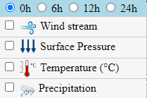
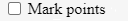
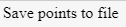
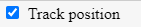

# SeaRouteMapper

Sea Route Mapper is a tool to plan routes on the water

## Features
- [Weather Forecast](#weather-forecast)
- [Sea marks](#sea-marks)
- [Planning routes](#planning-routes)
- [Two types of lines](#two-types-of-lines)
- [Saving planned routes to file](#saving-planned-routes-to-file)
- [Showing entered route from file](#showing-entered-route-from-file)
- [Enter coordinates of route one by one](#enter-coordinates-of-route-one-by-one)
- [Saving up to 3 routes](#saving-up-to-3-routes)
- [Information about position on the map](#information-about-position-on-the-map)
- [Tracking localization](#tracking-localization)
- [Other](#other)

## Details - How to use
Below there are detailed information about all the features with examples of usage
### Weather Forecast
The weather forecast contains information about wind stream, surface pressure, temperature and precipation. The application has four radio buttons which enables select the forecast for specific hour in the future - measured in relative time  - 0h, 6h, 12h, 24h from now. All the data are retived from the [weather open port guide](https://weather.openportguide.de/)

  

**WARNING**
All of above layers work with maximal zoom equals 7 - to zoom the map more the user has to unchecked all of the weather layers.

**NOTE**
For the wind stram and precipation there is availible slider to set the opacity of the layers - to improve the readability of the map.

### Sea marks
Sea marks contains two types of information:
- Ships on the sea - tracking live presence of the other ships 
- Static sea marks like ports, harbours, inland navigation or lights

The data about other ships are from [MarineTraffic](https://www.marinetraffic.com/) and the data about sea marks are from [OpenSeaMap](https://openseamap.org/)

  

### Planning routes
By default clicking on the map gives information about clicked point - if user wants to plan the route by marking points he/she should check the "Mark points" checkbox

  

### Two types of lines
User can choose between two types of lines - [loxodrome (rhumb line)](https://en.wikipedia.org/wiki/Rhumb_line) or [orthodrome (great circle)](https://en.wikipedia.org/wiki/Great_circle)

  

  
  

  <em>loxodrome vs orthodrome</em>

### Saving planned routes to file
There is an option to save planned route. The name of the file will be "route.txt"

  

**INFO**
Example of the "route.txt" file:

  

### Showing entered route from file
User can load csv or txt file. The notation can be decimal or degrees/minutes/seconds

  

**INFO**
Examples of files:

   
  
  

  <em>degrees notation with and without symbols vs decimal notation</em>

### Enter coordinates of route one by one
User can pass points one by one. To make another point he/she needs to press enter key. To submit user should press the submit button

  

  

### Saving up to 3 routes
User can save up to three routes which are stored in the memory. Each route has different colour - 1st is red, 2nd is green, 3rd is blue. To save the route to memory user have to click "Save and start new route" button. To show specific route user should check proper checkbox.

  

  

  <em>Example routes stored in the memory</em>

### Information about position on the map
There are tools on the map which help to specify the position and distance on the map. There is a scale in the left bottom which helps measure distance between two points. There is also information about coordinates of point pointed by the mouse and current zoom in the bottom right corner

**INFO** 
Please keep in mind that the scale resizes automatically even without zooming. The map is the Mercator projection.

  

  

### Tracking localization
There is possibility to turn on tracking your current possition - the event is managed by user's browser - he/she can agree or disablee to be localized

  

### Other
- If user clicks on the land the warning will be showed - the tool checks if user is not passing not valid data